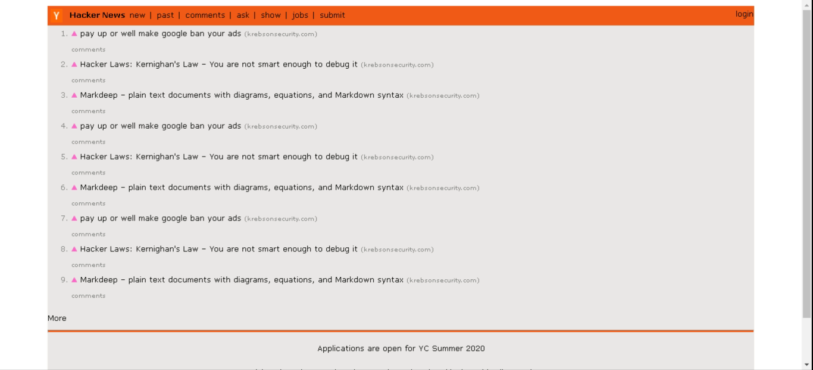
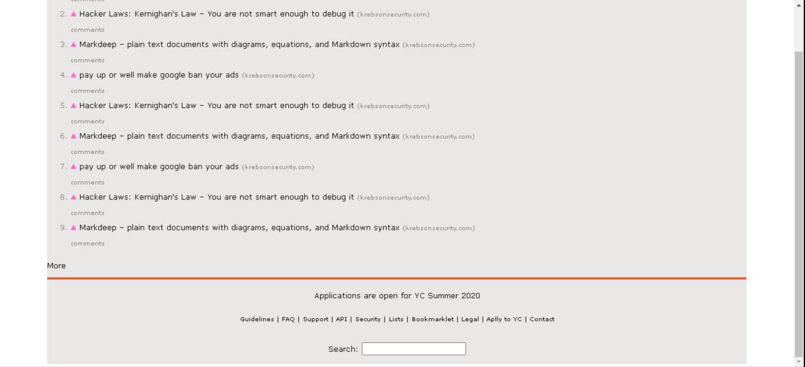

"# Clone-Hacker-News" 
Clone do Hacker News feito por mim no NPI (Núcleo de Práticas em Informática) da Unifil Londrina.
 
Nesse projeto foi utilizado o **float** ao invés do **flexbox**, porque não tinha conhecimento sobre o flexbox.
 

